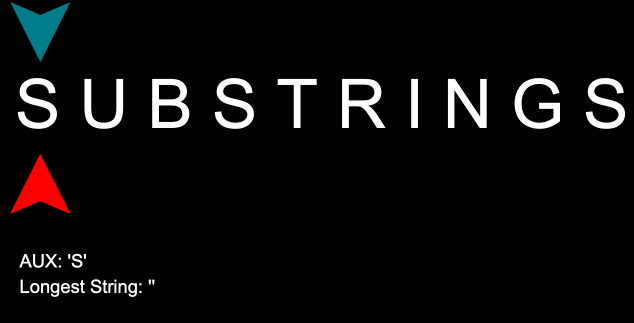

# Question

##### Given a string, find the length of the longest substring without repeating characters. Can you find a solution in linear time?

Here is an example solution in Python language

``` python
class Solution:
  def lengthOfLongestSubstring(self, s):
    # Fill this in.

print Solution().lengthOfLongestSubstring('abrkaabcdefghijjxxx')
# 10
``` 

# Alert 
if you don't to see the solution yet, do not keep reading. Go back after trying `XD`

# Solution
I'll solve this problem with two different implementations. The first one in polynomial Time and the second one in Linear Time.

### Polinimial Time Solution
It's quite simple to think about this problem in terms of a for loop inside another for loop. In few words, this solution starts with a pointer to the initial character of the string and iterates a second pointer over the rest of the string until a repeated character or the end of the string be reached. This way, after each iteration of the inner loop, we will end up with a substring containing only unique characters so we can measure each subtring lenght and choose the longest one.


This approach is enough to find de longest substring length but it spends a lot of time due to many times it iterates over the string

### Linear Time Solution
This approach iterates over the substring only once, keeping one pointer in a possible initial position of the substring and a second pointer iterating over the rest of the string marking a possible final position of the longest substring every iteration. Always a repeated character is reached the first pointer will pointer to the next character after the first ocurrence of the character reached. 



